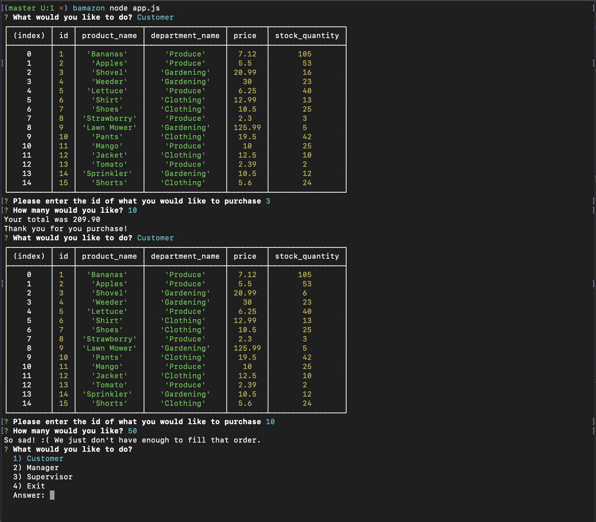

# bamazon Shopping App

## Goal of the project
Creating a barebones amazon clone which uses a SQL database and alters database information using the mySQL npm package.

## Options available

### Customer
Selecting this option allows the user to choose an item from the list of items by entering an prodcut id number then entering a quantity to purchase. The user will then be shown a total cost and a thank you message. If the store does not have enough in stock the user will be notified and the transaction ended.

### Manager
Selecting this option allows the user to manage the store. Options include:
#### Products for Sale
This will allow the user to see all items available in the store.
#### Check inventory
This option allows the user to view items that have low inventory.

#### Add Inventory
This option allows the user to add more quantity to a product.

#### Add Product
This option allows the user to add a new product to the database.

### Supervisor
This option is planned for future development and would allow a supervisor to view total sales by department and to also crete new departments.

#### For help and support
Contact Bob Church at bobachu.developer@gmail.com

Project maintained by Bob Church
